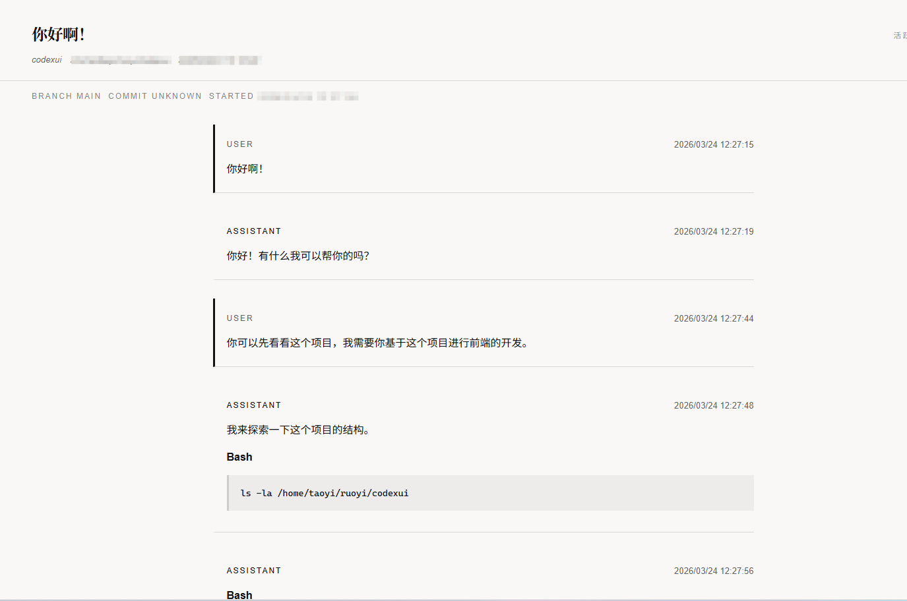

# Claude Session Browser

A local browser for Claude sessions. It reads conversation files from `~/.claude` and presents them in a left sidebar plus right detail view for easier searching and reading.

[中文说明](./README.md)

## Highlights

- Local-first, default bind address is `127.0.0.1`
- Reads Claude session files directly without modifying raw data
- Full-text search and multi-dimensional filters
- Time-range filtering for recent session review
- Sidebar list plus detail reader is much easier than reading raw JSONL

## Background

Claude CLI stores sessions as local files, but raw JSONL is not convenient to read. This project provides a lightweight web UI for browsing session history by project, directory, time range, and keyword.

The current implementation reads Claude session directories and Claude-style data structures. It does not support Codex session data format yet.

## Preview



## Scope

- Read local Claude session files and build an in-memory index
- Browse sessions in the sidebar and read transcripts in the detail pane
- Keyword search
- Filter by active or archived scope
- Filter by project, directory, source, and originator
- Filter by updated time using presets or custom date ranges
- Re-scan local directories and rebuild the index
- Default local-only binding on `127.0.0.1`

Non-goals:

- Do not modify raw session files
- Do not write data into a database
- Do not provide authentication or multi-user permissions

## Data Source

Default directories:

- Active sessions: `~/.claude/projects`
- Archived sessions: `~/.claude/archived_sessions`

You can override the root directory with `CODEX_HOME`. The variable name is historical; the current implementation still reads Claude session data.

## Security Notes

This project does not copy your local sessions into the repository and does not create extra on-disk storage. It works by:

- scanning local session files at startup
- parsing them into server memory
- serving them to the frontend through local APIs

This means:

- sharing the source repository usually does not share your local session data
- sharing a running service does expose the data available on that machine to anyone who can access the service

The default mode listens on localhost only. LAN exposure only happens if you explicitly start it in LAN mode.

## Quick Start

Requirements:

- Node.js 20+
- npm

Install dependencies:

```bash
npm install
```

Run in development:

```bash
npm run dev
```

Default URL:

```text
http://127.0.0.1:4318
```

Build:

```bash
npm run build
```

Start the production build:

```bash
npm start
```

Run tests:

```bash
npm test
```

## LAN Mode

If you intentionally want access from other devices on your local network:

```bash
npm run dev:lan
```

or:

```bash
npm run start:lan
```

In LAN mode the server binds to `0.0.0.0` and allows requests from localhost and private network ranges. Do not use this mode on untrusted networks.

## Environment Variables

- `CODEX_HOME`
  Custom session root directory. Default is `~/.claude`.
- `PORT`
  Server port. Default is `4318`.
- `HOST`
  Bind address. Defaults to `127.0.0.1` in local mode and `0.0.0.0` in LAN mode.
- `ACCESS_MODE`
  Optional values: `localhost` or `lan`. Defaults to local mode.

Example:

```bash
CODEX_HOME=/data/claude-sessions PORT=8080 npm run dev
```

## Usage

1. Start the app and the left sidebar will show the session list.
2. Use the search box to search titles, previews, project names, and directory information.
3. Open the filter panel to narrow results by project, directory, source, originator, and updated time.
4. Click any session to read the parsed transcript in the right pane.
5. Click `刷新索引` to re-scan local files without modifying the raw data.

## Project Structure

```text
.
├─ src/                  Frontend UI (React + Vite)
├─ server/               Express server, indexing, and parsing
├─ shared/               Shared types between frontend and backend
├─ tests/                Parser and API tests
├─ dist/                 Build output
├─ index.html            Frontend entry template
└─ package.json          Scripts and dependencies
```

Key files:

- `src/App.tsx`
  Main layout and filter state management.
- `src/components/Sidebar.tsx`
  Session list and filter panel.
- `src/components/DetailPane.tsx`
  Transcript reader.
- `server/store.ts`
  Local file scanning, in-memory indexing, and list filtering.
- `server/parser.ts`
  Claude JSONL parsing and transcript shaping.

## API Overview

There is no `openapi.json` in the current project. The implementation is the source of truth.

- `GET /api/health`
  Health check.
- `GET /api/sessions`
  Returns the session list and supports `q`, `scope`, `repo`, `cwd`, `source`, `originator`, `from`, `to`, `sort`, `order`, `page`, and `pageSize`.
- `GET /api/sessions/:id`
  Returns a single session detail.
- `POST /api/reindex`
  Re-scans local directories and rebuilds the in-memory index.

Example:

```bash
curl "http://127.0.0.1:4318/api/sessions?scope=active&sort=updated&order=desc&pageSize=20"
```

## FAQ

### Why is the environment variable still called `CODEX_HOME`?

That is a historical naming leftover. The current implementation reads Claude session data, and the package name and user-facing copy have already been updated, but the environment variable is still kept as `CODEX_HOME` for now.

### Does `刷新索引` modify raw data?

No. It only re-scans files and rebuilds the in-memory index.

### Why can't I see any sessions?

Check the following:

- whether `~/.claude/projects` or `~/.claude/archived_sessions` actually contains session files
- whether `CODEX_HOME` points to the wrong directory
- whether your current filters are too restrictive

## Current Limitations

- The parser currently targets Claude session file structure
- `source`, `originator`, and `cliVersion` are not fully populated yet
- This project is best suited for personal local use, not direct public deployment
